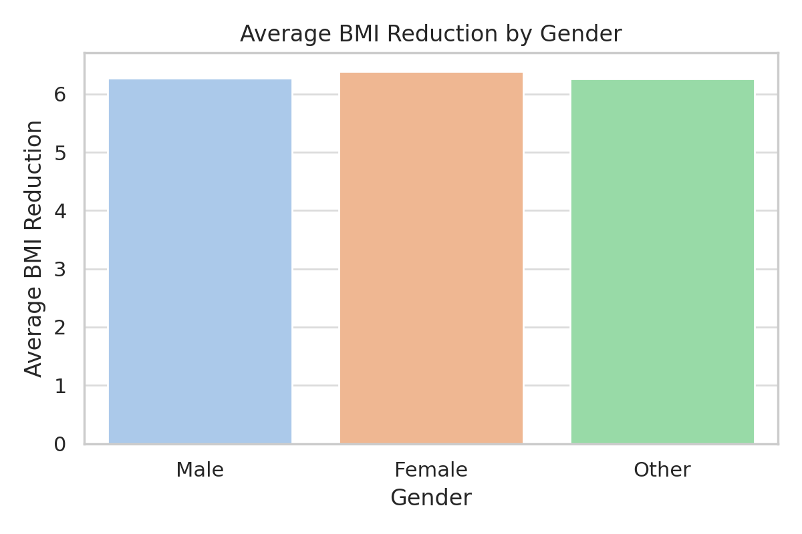
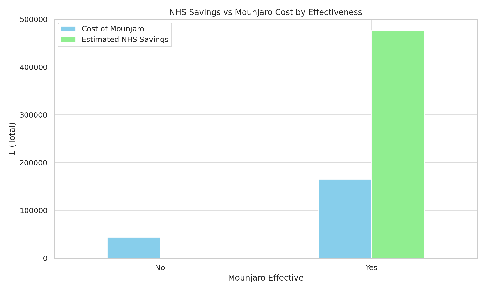
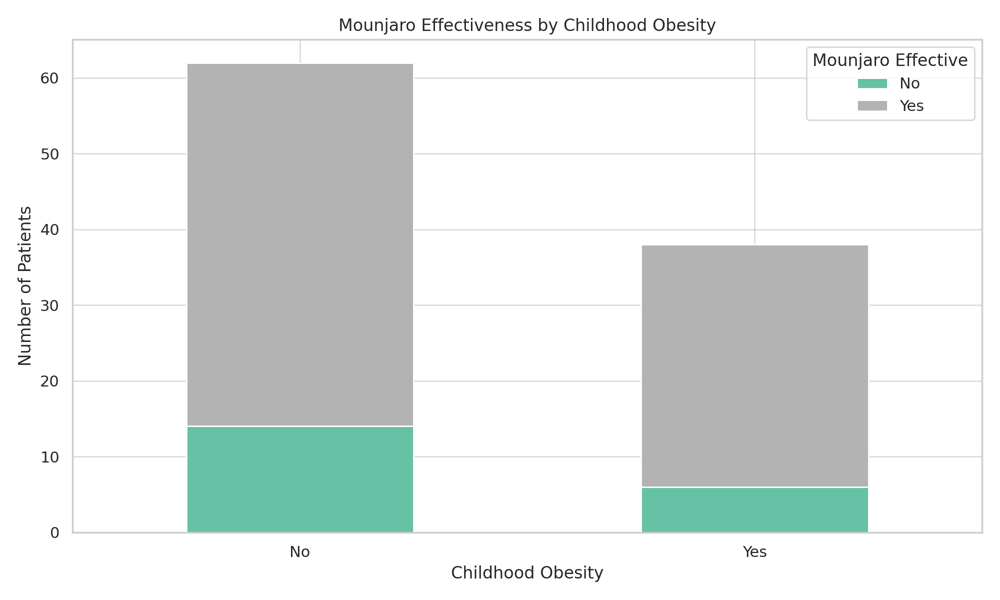

**Data Analysis Notes: Mounjaro & NHS Savings**

This file contains short interpretations of the key visuals generated from the dataset in `mounjaro_patients.xlsx`.

---

****1. Average BMI Reduction by Gender**

**Insight:**
- **All genders experienced a notable BMI reduction**, with slightly higher averages among women.
- This indicates that Mounjaro has a **broad effect across genders**, and no one group dominates in response.

---

**2. NHS Savings vs Mounjaro Cost by Effectiveness**

**Insight:**
- Patients marked as **"Effective"** generated **significant cost savings** for the NHS, often outweighing the treatment cost.
- Patients where Mounjaro was **"Not Effective"** still incurred the cost, but **with no savings**, emphasizing the value of targeting the right population.

---

**3. Mounjaro Effectiveness by Childhood Obesity**

**Insight:**
- Patients with **childhood obesity** showed higher effectiveness compared to those with other causes.
- This may suggest early-onset obesity requires **different intervention strategies** or longer treatment plans.

---

**Summary:**

- Mounjaro appears **effective and cost-beneficial** for most patients.
- Visuals help us explore **which subgroups** benefit the most, informing better **policy and funding decisions**.
- Further analysis could combine more detailed medical histories and comorbidities for a more complete picture.

